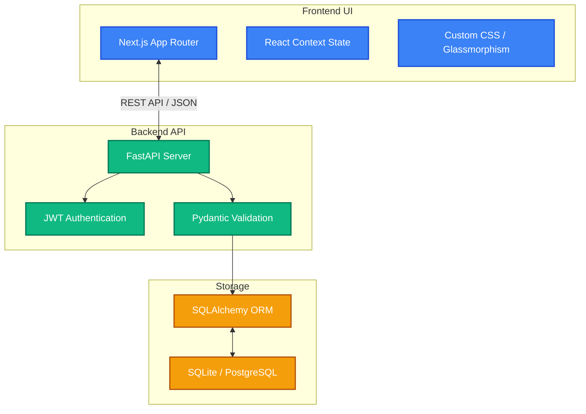

# KaarPlatform (Knowledge-Innovation Intelligence Platform)

KaarPlatform is an internal enterprise SaaS application designed specifically for KaarTech to facilitate knowledge sharing, structured problem-solving, collaborative innovation, and psychologically safe learning from project failures.

The platform empowers employees to share insights, upvote high-impact solutions, and build professional reputation in a modern, engaging interface. 

---

## 🚀 Key Modules & Features

The platform is divided into several main pillars, each serving a distinct purpose in the enterprise knowledge ecosystem:

### 1. Knowledge Feed (The Hub)
A central space for sharing challenges, solutions, achievements, and general information.
- Supports dual-visibility (public vs. anonymous posting).
- Users can post solutions to challenges, which authors can mark as "Resolved."
- Interactive metrics: Helpful upvotes, comments, and saves.

### 2. Innovation Engine
A structured pipeline for proposing, evaluating, and incubating new business concepts or technical ideas.
- Captures critical data points: Business Pain Point, Proposed Solution, Expected Impact, Scalability Potential, and Prototype Complexity.
- Community voting establishes demand and value.

### 3. Failure Learning Wall
A dedicated, psychologically safe space to document and learn from project missteps.
- Requires structural analysis: Context, Wrong Assumptions, Impact Level, Lessons Learned, and a Prevention Checklist.
- Encourages a culture of transparency and continuous improvement over blame.

### 4. Continuous Improvement Suggestions
An open forum for employees to suggest and upvote improvements to company culture, operational processes, or workspace environment.

### 5. Contributor Reputation System
A gamified engine that inherently measures and rewards valuable participation across the platform.
- Users gain "Reputation Scores" based on the helpfulness of their posts, the adoption of their solutions, and community votes.
- Features a real-time Leadership / Contributor Board to recognize top talent.

### 6. Content Moderation & Admin Dashboard
Ensures the platform remains a safe, productive space.
- Users can report Posts, Comments, Innovations, Failures, and Suggestions with specific reasoning.
- Administrators utilize a dedicated dashboard to review reports and take appropriate action (Warning, Removal, or Dismissal).

---

## 🛠️ Tech Stack Architecture

The application is built using a modern, decoupled architecture designed for high performance and rapid iteration.



### Frontend Client
- **Framework:** Next.js (React 18)
- **Language:** TypeScript for end-to-end type safety
- **Styling:** Custom CSS focusing on Glassmorphism, modern gradients, and fluid UI components matching KaarTech brand guidelines.
- **Icons:** Lucide React
- **State Management & Routing:** Next.js App Router and React Context API.

### Backend API Server
- **Framework:** FastAPI (Python)
- **Validation:** Pydantic models for strict API request/response validation
- **Database ORM:** SQLAlchemy
- **Authentication:** JWT (JSON Web Tokens) with Role-Based Access Control (Admin, Leadership, Innovation Mentor, Employee)
- **Database:** SQLite (Development environment ready, easily migratable to PostgreSQL for Production)

---

## 🏃‍♂️ Local Development Setup

Follow these instructions to get both the backend server and frontend client running on your local machine.

### Prerequisites
- Node.js (v18+ recommended)
- Python (v3.10+ recommended)
- Git

### 1. Starting the Backend (FastAPI)

1. Open a terminal and navigate to the backend directory:
   ```bash
   cd backend
   ```
2. Create and activate a Python virtual environment:
   ```bash
   python -m venv venv
   # On Windows:
   .\venv\Scripts\Activate.ps1
   # On macOS/Linux:
   source venv/bin/activate
   ```
3. Install the Python dependencies:
   ```bash
   pip install -r requirements.txt
   ```
4. Run the database migration script to generate the SQLite database and tables:
   ```bash
   python create_db.py
   python create_reports_table.py
   ```
5. Start the FastAPI development server:
   ```bash
   python -m uvicorn main:app --reload
   ```
   *The backend will be available at `http://localhost:8000`. You can view the automatic interactive API documentation at `http://localhost:8000/docs`.*

### 2. Starting the Frontend (Next.js)

1. Open a *new* terminal window and navigate to the frontend directory:
   ```bash
   cd frontend
   ```
2. Install the Node modules and dependencies:
   ```bash
   npm install
   ```
3. Start the Next.js development server:
   ```bash
   npm run dev
   ```
   *The frontend will be available at `http://localhost:3000`.*

---

## 🔐 Default Test Accounts

To easily explore the platform's different roles, you can register new accounts via the UI, or utilize the roles directly via the database. To simulate different permission levels, register a user with one of the following roles:

* `EMPLOYEE`
* `INNOVATION_MENTOR`
* `LEADERSHIP`
* `ADMIN` (Required to access the Reports Dashboard)

---
*Developed for KaarTech - In Pursuit of Excellence*
